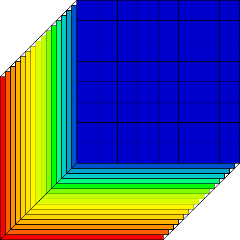
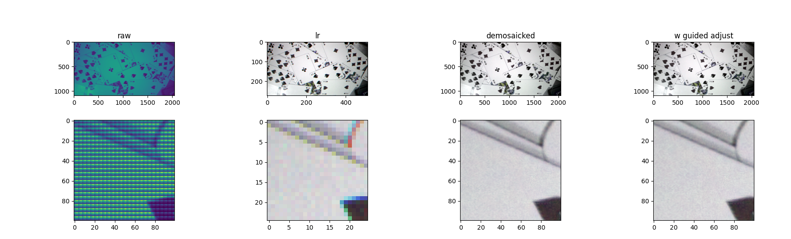

# About

<p align="center" width="100%">

 
  
</p>

[Rafał Muszyński](https://orcid.org/0000-0002-1676-8458), [Hiep Luong](https://telin.ugent.be/~hluong/)

[URC](https://urc.ugent.be/) - [IPI](https://ipi.ugent.be/) - [Ghent University](https://www.ugent.be/en), [IMEC](https://www.imec.be/nl)

Official implementation of the paper "CUBE IT: Training Hyperspectral Demosaicing Models using Synthetic Datasets" featured at 14th edition of the [WHISPERS conference](https://www.ieee-whispers.com/)

## Abstract

Hyperspectral demosaicing aims to recover full spectral information at each pixel from a mosaicked image captured using a snapshot camera. Cameras vary in terms of used multispectral filter arrays (MSFA). SOTA demosaicing algorithms are evaluated and trained on a handful of publicly available datasets, and their performance does not transfer well to images captured with previously unseen cameras. Performing demosaicing for a specific MSFA requires training a new model, which is time-consuming and may require capturing new datasets, which hinders usability of SOTA models. We demonstrate, that demosaicing models with near SOTA performance can be trained using existing RGB datasets with simple hyperspectral augmentations. By performing random band reordering in the MSFA during training, our models seamlesly work with different MSFA. Conducted experiments show good quantitive and qualitative results.

 
# Info

Currently, this repository contains only the inference code as well as pretrained models.

Training code coming soon.

# Installation
The following line installs the cubeit package
```bash
pip install .
```

## Requirements:
```bash
pip install torch numpy opencv-python
```

Project tested with
```
pip install torch==2.0.1 numpy==1.26.4 opencv-python==4.10.0.84
```

Additionally, to run the demo:
```bash
pip install matplotlib
```

## Pretrained models
* trc_bi_ntire_16_band_mixed.pth.tar : model trained on the NTIRE dataset, with band permutations during training
* trc_bi_synth_coco_100k.pth.tar : model trained on 100k RGB images from the COCO dataset, transformed into random hyperspectral cubes during training

## Run the demo
```
python demo.py
```
Which results in the followint output:




Function im2cube takes in an additional argument: guided_adjust. When set to True, this flag applies additional postprocessing on the predicted cube and reduces the reprojection error. This step significantly increases the demosaicing time.

## How to cite

... comming soon ...
