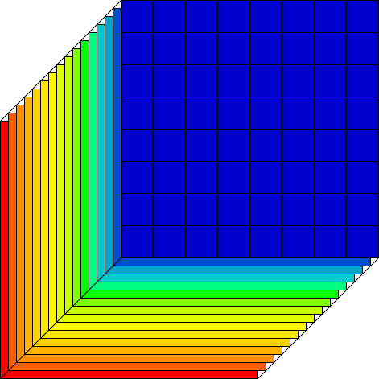

# About

<p align="center" width="100%">

 
  
</p>

[Rafał Muszyński](https://orcid.org/0000-0002-1676-8458), [Hiep Luong](https://telin.ugent.be/~hluong/)

[URC](https://urc.ugent.be/) - [IPI](https://ipi.ugent.be/) - [Ghent University](https://www.ugent.be/en), [IMEC](https://www.imec.be/nl)

Official implementation of the paper "CUBE IT: Training Hyperspectral Demosaicing Models using Synthetic Datasets" featured at 14th edition of the [WHISPERS conference](https://www.ieee-whispers.com/)

[paper](https://ieeexplore.ieee.org/document/10876469)

## Abstract

Hyperspectral demosaicing aims to recover full spectral information at each pixel from a mosaicked image captured using a snapshot camera. Cameras vary in terms of used multispectral filter arrays (MSFA). SOTA demosaicing algorithms are evaluated and trained on a handful of publicly available datasets, and their performance does not transfer well to images captured with previously unseen cameras. Performing demosaicing for a specific MSFA requires training a new model, which is time-consuming and may require capturing new datasets, which hinders usability of SOTA models. We demonstrate, that demosaicing models with near SOTA performance can be trained using existing RGB datasets with simple hyperspectral augmentations. By performing random band reordering in the MSFA during training, our models seamlesly work with different MSFA. Conducted experiments show good quantitive and qualitative results.

 
## Coming soon - Code and models realase

## How to cite

```
@INPROCEEDINGS{10876469,
  author={Muszyński, Rafał and Luong, Hiep},
  booktitle={2024 14th Workshop on Hyperspectral Imaging and Signal Processing: Evolution in Remote Sensing (WHISPERS)}, 
  title={Cube it: Training Hyperspectral Demosaicing Models Using Synthetic Datasets}, 
  year={2024},
  pages={1-5},
  doi={10.1109/WHISPERS65427.2024.10876469}}
```

R. Muszyński, H. Luong, "CUBE IT: Training Hyperspectral Demosaicing Models using Synthetic Datasets", in Proceedings WHISPERS 2024 conference, 2024
